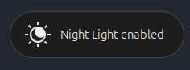
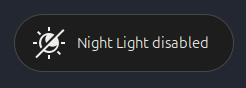

### Gnome Extension: Night light OSD

This is a Gnome extension (currently tested for Gnome 46 on Ubuntu 24) that adds an OSD (On Screen Display) similar to muting the sound to the screen when the night light is turned on or off.
This is a simple nicety or gives you a simple notification when external scripts trigger the night light on/off (via gsettings or dconf e.g.).




## Installation

```bash
mkdir -p .local/share/gnome-shell/extensions/gnome-extensions enable night-light-osd@gnome-extension.com
cd .local/share/gnome-shell/extensions/gnome-extensions enable night-light-osd@gnome-extension.com
git clone https://github.com/mixmash/gnome-extension-night-light-osd
gnome-extensions enable night-light-osd@gnome-extension.com
```


## TODO / Warning
- [ ] Currently the icons are used that are built into the standard Gnome theme, check the documentation to adapt to theme and maybe also add them to the repo to make it self-contained
